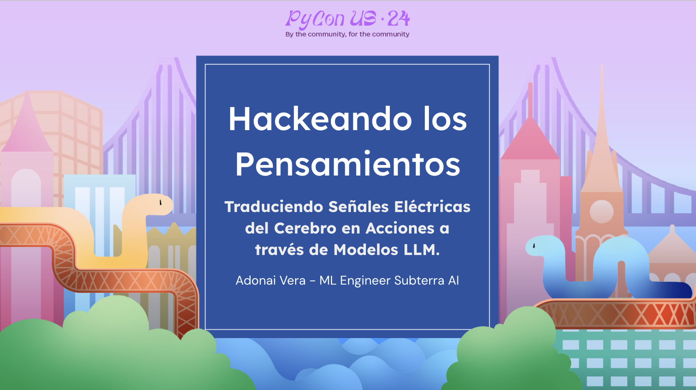
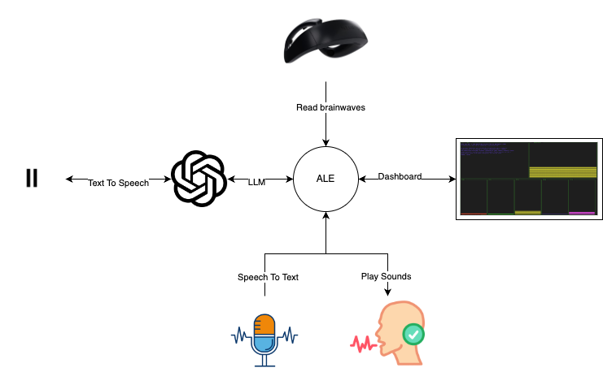

# Hackeando el Pensamiento: Traduciendo Señales Eléctricas del Cerebro en Acciones a través de Modelos LLM

## Overview
"Hackeando el Pensamiento: Traduciendo Señales Eléctricas del Cerebro en Acciones a través de Modelos LLM" is a comprehensive talk presented at PyCon 2024. This session, led by Adonai Vera from Subterra AI, dives into the intersection of neuroscience and machine learning to explore how brainwaves can be harnessed to drive actions using Large Language Models (LLMs).

## Presentation
View the full presentation on "Hackeando el Pensamiento: Traduciendo Señales Eléctricas del Cerebro en Acciones a través de Modelos LLM" by clicking the image below:

## Key Topics
1. **Introduction to Brainwaves**: Understanding the electrical impulses generated by the brain.
2. **History of EEG Technology**: Tracing the advancements in brain monitoring.
3. **Neurosity and Real-Time EEG Monitoring**: Insights into modern EEG technology and its capabilities.
4. **Practical Applications**: From everyday activities to complex BCI (Brain-Computer Interface) tasks.
5. **Live Demonstrations**: Real-time interaction with GPT-4, translating brain signals into actionable outputs.
6. **Conclusions and Future Steps**: How this technology will evolve and its potential future impacts.

## Getting Started
To run the demonstration code provided:
1. **Set Up Environment**:
   - Ensure Python 3.8+ is installed.
   - Install required packages: `pip install -r requirements.txt`
2. **Configuration**:
   - Input your API keys and device IDs in the `config.py` file.
3. **Running the Application**:
   - Execute the main script: `python main.py`

## Including Graphs and Visuals
- Graphs from the presentation are included to illustrate:
  - The types of brainwaves and their significance.
  - Real-time data analysis and interpretation through the Neurosity device.
- Visual aids help in understanding the complex dynamics of brain-to-computer communication.

## Integrations and Libraries Used

### OpenAI ChatGPT API
Description: Processes natural language to generate responses based on brainwave data.
Usage: Translates brainwave patterns into text to enhance user-system interaction.

### ElevenLabs API
Description: Converts generated text into natural-sounding audio.
Usage: Provides auditory feedback, making the application accessible to visually impaired users.

### Neurosity Crown
Description: Advanced EEG device capturing real-time brain activity.
Usage: Analyzes brainwave patterns to detect mental states like relaxation and concentration.

### Dashing Library (using Blessed)
Description: Creates interactive dashboards to display real-time data.
Usage: Visualizes brainwave data and system statuses interactively.

### Python Speech Recognition
Description: Converts spoken words into digital text.
Usage: Enables voice commands and verbal interactions, enhancing usability.

## Resources and Further Reading
- Links to additional resources, including detailed documentation on EEG technology and the latest advancements in BCI:
  - [Neurosity Official Website](https://www.neurosity.co)
  - [YouTube Demonstration Videos](http://www.youtube.com/watch?v=vDlZyyUtvsA)
  - [Educational EEG Background](https://www.ncbi.nlm.nih.gov)

## Contributing
- Contributions to the project are welcome. Please read through the contribution guidelines in `CONTRIBUTING.md`.
- For major changes, please open an issue first to discuss what you would like to change.

## License
This project is licensed under the MIT License - see the [LICENSE](LICENSE.md) file for details.

## Contributor
* **Adonai Vera** - *Computer vision subterra AI* - [AdonaiVera](https://github.com/AdonaiVera)

Adonai Vera, a Machine Learning Engineer at Subterra AI, is passionate about making AI technology more accessible and user-friendly. More about Adonai's work and contributions can be found at [my personal website](http://www.adonaivera.com).
